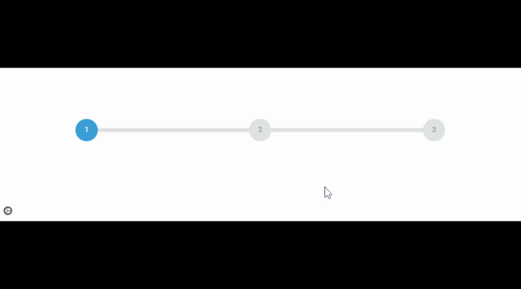

# Stream Steps

Display a stepper into your stream for example with <a href="https://obsproject.com/">OBS</a>.

## Demo

[Demo](http://tools.bitfertig.de/stream-steps/)

## Settings

* Hide settings button 
* Amount of steps
* Naming of steps